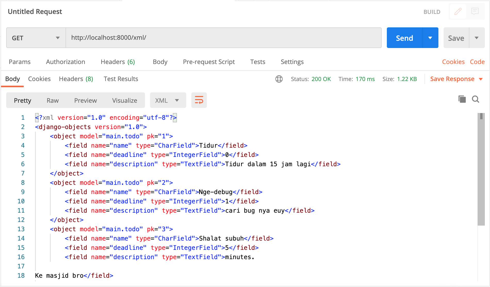

http://khair-juzaili-todotracker.pbp.cs.ui.ac.id/

Jelaskan bagaimana cara kamu mengimplementasikan checklist di atas secara step-by-step

Buat proyek Django bernama <nama proyek> dengan perintah berikut.

```
django-admin startproject <nama proyek> .
```

Jalankan perintah berikut untuk membuat aplikasi baru.

```
python manage.py startapp <nama app>
```

---
Buatlah bagan yang berisi request client ke web aplikasi berbasis Django beserta responnya dan jelaskan pada bagan tersebut kaitan antara urls.py, views.py, models.py, dan berkas html.

urls.py meneruskan request dari user ke view yang sesuai, views.py memasukkan data yang sudah dibaca dari model ke template (berkas html), models.py berurusan terkait read/write data, dan berkas html menyediakan template html web tersebut.

---
Jelaskan mengapa kita menggunakan virtual environment? Apakah kita tetap dapat membuat aplikasi web berbasis Django tanpa menggunakan virtual environment?

Agar bisa mengisolasi package dan dependencies aplikasi agar tidak bertabrakan dengan versi lain. Kita tetap bisa membuat aplikasi web berbasis Django tanpa menggunakan virtual environment akan tetapi ada kemungkinan muncul masalah karena bertabrakannya package dan dependencies aplikasi dari versi yang berbeda.

---
Jelaskan apakah itu MVC, MVT, MVVM dan perbedaan dari ketiganya?

MVT (Model-View-Template) 
Model: Menyimpan data dan logika aplikasi.
View: Menampilkan data dari model dan menghubungkannya dengan template.
Template: Menentukan tampilan antarmuka pengguna.

MVC (Model-View-Controller) dan MVVM (Model-View-ViewModel) adalah dua arsitektur desain perangkat lunak populer yang digunakan dalam pengembangan aplikasi. Kedua arsitektur memiliki perbedaan antara controller dan view model sebagai berikut:

Model-View-Controller (MVC): Dalam arsitektur MVC, controller bertanggung jawab untuk menerima input dari pengguna dan mengubah model sesuai dengan input tersebut. Controller juga berfungsi untuk mengirimkan respons ke view. View model tidak ada dalam arsitektur ini. Model mewakili data dan logika bisnis aplikasi.

Model-View-ViewModel (MVVM): Dalam arsitektur MVVM, view model berfungsi sebagai perantara antara model dan view. View model menyediakan data dan operasi yang dibutuhkan oleh view. Dalam arsitektur MVVM, controller tidak digunakan. View model mengendalikan aliran data antara model dan view, serta mengelola keadaan view. View, di sisi lain, hanya bertanggung jawab untuk menampilkan data.

Dalam kesimpulannya, perbedaan antara controller dan view model pada arsitektur MVC dan MVVM terletak pada fungsinya. Controller pada arsitektur MVC berperan untuk mengendalikan aliran data antara model dan view, sementara view model pada arsitektur MVVM berperan sebagai perantara antara model dan view.

TUGAS 3

Apa perbedaan antara form POST dan form GET dalam Django?
post: Corresponds to the HTTP POST method ; form data are included in the body of the form and sent to the server.
get: Corresponds to the HTTP GET method; form data are appended to the action attribute URI with a '?' as separator, and the resulting URI is sent to the server. Use this method when the form has no side-effects and contains only ASCII characters.

Apa perbedaan utama antara XML, JSON, dan HTML dalam konteks pengiriman data?
Sintaks JSON menggunakan sintaks object di JS, sedangkan XML menggunakan ketentuan XML seperti menggunakan tag (<>) dll, dan HTML juga menggunakan tag seperti XML tetapi data HTML bertujuan untuk menunjukkan struktur page tersebut.

Mengapa JSON sering digunakan dalam pertukaran data antara aplikasi web modern?
Karena sintaksnya mudah dipahami oleh mesin.

Jelaskan bagaimana cara kamu mengimplementasikan checklist di atas secara step-by-step (bukan hanya sekadar mengikuti tutorial).

1. Buat berkas forms.py dan tentukan model yang akan digunakan untuk form serta field-fieldnya.
2. Buat fungsi di views untuk render HTML yang akan dipanggil saat mengakses url-nya ataupun saat menekan tombol add new todo
3. Tambahkan kode untuk menampilkan todo-todo yang ada (di fungsi show_main)
4. Hubungkan url untuk menambahkan todo dengan methodnya
5. Buat HTML untuk page menambahkan todo
6. Tambahkan kode di main.html untuk membuat button menuju page menambahkan todo dan kode untuk menampilkan todo yang sudah ada sebagai tabel
7. Buat fungsi-fungsi untuk translate objek model menjadi format XML dan JSON dengan menggunakan serializers
8. Tambahkan path url ke dalam urlpatterns untuk fungsi-fungsi tadi




TUGAS 4

Apa itu Django UserCreationForm, dan jelaskan apa kelebihan dan kekurangannya?

UserCreationForm adalah impor formulir bawaan yang memudahkan pembuatan formulir pendaftaran pengguna dalam aplikasi web. Dengan formulir ini, pengguna baru dapat mendaftar dengan mudah di situs web Anda tanpa harus menulis kode dari awal. Kelebihannya kita bisa langsung menggunakannya karena sudah ada librarynya namun ia mempunyai kekurangan seperti terbatasnya fitur-fitur yang tersedia, jika kita ingin menambahkan fitur baru kita harus memodifikasi UserCreationForm atau membuat class serupa dari awal.

Apa perbedaan antara autentikasi dan otorisasi dalam konteks Django, dan mengapa keduanya penting?

Authentication berarti mengkonfirmasi identitas sehingga data bisa dipersonalisasi sedangkan authorization berarti memberikan akses ke sistem. Authentication penting agar Django mengetahui siapa yang sedang mengakses aplikasi web dan authorization penting karena tidak semua user memiliki otoritas yang sama, ada bagian yang hanya biasa diakses user tententu.

Apa itu cookies dalam konteks aplikasi web, dan bagaimana Django menggunakan cookies untuk mengelola data sesi pengguna?

Sejumlah kecil informasi yang dikirim oleh server web ke browser dan kemudian dikirim kembali oleh browser pada request page berikutnya. Cookie digunakan untuk autentikasi, pelacakan user, dan menyimpan preferensi user. Data cookie berupa pasangan key value yang dikirim di dalam header request client.

Apakah penggunaan cookies aman secara default dalam pengembangan web, atau apakah ada risiko potensial yang harus diwaspadai?

Ada risiko yang harus diwaspadai dalam penggunaan cookies seperti Cookie/Session Poisoning yaitu mengubah data cookie untuk mendapatkan akses yang tidak sah.

Jelaskan bagaimana cara kamu mengimplementasikan checklist di atas secara step-by-step (bukan hanya sekadar mengikuti tutorial).

1a. Membuat form untuk registrasi dengan menggunakan class UserCreationForm, membuat fungsi terkait registrasi dan template HTML nya dan menghubungkannya dengan URL yang sesuai di urls.py.
1b. Membuat fungsi untuk login dengan mengimport fungsi authenticate dan login, membuat template HTML nya dan menghubungkan URL untuk login dengan fungsi yang dibuat tadi. 
1c. Membuat fungsi untuk logout dengan mengimport fungsi logout, menambahkan elemen button pada main.html yang akan memanggil fungsi yang dibuat tadi, dan menghubungkan URLnya dengan fungsi yang tadi dibuat juga.

3. Tambahkan atribut user pada model Todo dengan user yang sedang login (jadi foreign key)dijadikan sebagai valuenya, mengubah sedikit fungsi create_todo untuk mem-passing user yang sedang login saat ini sebagai value untuk field user, dan ubah juga sedikit fungsi show_main agar hanya menampilkan todo-todo yang sesuai dengan user yang sedang login (menggunakan method filter) serta ubah value name menjadi username user yang sedang login, dan terakhir ubah perubahan dengan melakukan migrasi (memakai command makemigrations dan migrate).

4. Tambahkan cookie last_login dengan menggunakan method set_cookie di fungsi login_user, tambahkan data cookie untuk ditampilkan di main.html pada variabel context di fungsi show_main, hapus cookie saat user logout dengan menggunakan method delete_cookie (di fungsi logout_user), dan terakhir tambahkan elemen header untuk menampilkan data last_login di main.html.

